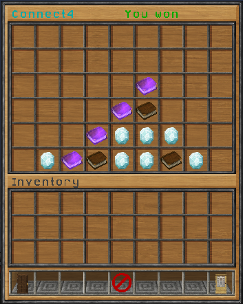

# Connect Four

Connect Four is an inventory game for the Spigot plugin [GameBox]. It is distributed in the GameBox jar which is published on [Spigot](https://www.spigotmc.org/resources/37273/).

Connect Four is a two player game. Each player throws chips into the grid trying to get four in a row. All items and messages are configurable.

[GameBox]: https://github.com/NiklasEi/GameBox